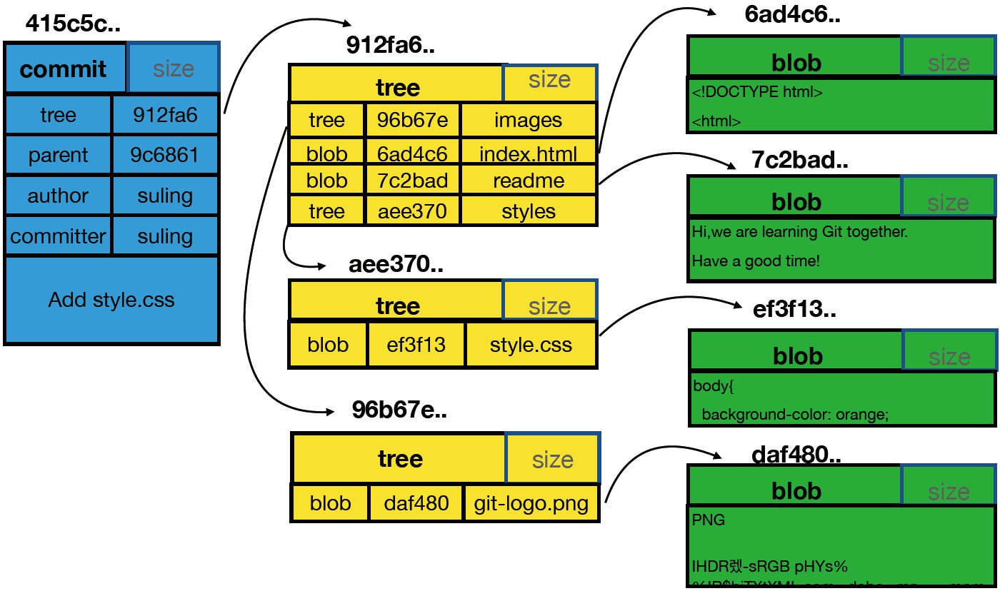

### 配置git环境

***

**添加配置**

```
git config [--local | --global | --system] user.name 'Your name'
git config [--local | --global | --system] user.email 'Your email'

```

**查看配置**

```
git config --list [--local | --global | --system]
```

**区别**

```
local：区域为本仓库
global: 当前用户的所有仓库
system: 本系统的所有用户
```

**git add . 和 git add -u区别**

```
git add . ：将工作空间新增和被修改的文件添加的暂存区
git add -u :将工作空间被修改和被删除的文件添加到暂存区(不包含没有纳入Git管理的新增文件)
```

**将文件复制到仓库**

```
cp 被拷贝文件名 新建文件名 ; 复制一个新的文件
cp -r 被拷贝目录 新建目录 ; 拷贝目录
```

**查看文件操作**

- clear   清空cmder窗口内容

- cd   进入某个文件夹

- cd  ../  返回上级目录

- pwd   查看当前的绝对路径

- ls   查看当前目录的文件列表   默认不显示以‘ . ’开头的文件
  - ls -l  ;  查看文件列表并显示更新时间
  - ls -al;查看所有文件
- ls  路径  ; 查看指定路径文件的内容列表

- cat    路径   ;  查看指定文件的具体内容(文字，代码)   内容过多会一直滚动页面  因此不常用

- head    路径  ;   查看指定文件的具体内容(文字，代码)  默认前10行   可通过 -n  数字  修改

**增加文件**

* mkdir   文件夹名/  ;  创建指定名称的文件夹

- mkdir  -p  文件名/文件名/文件名......  ；   创建多层级的目录文件
- 创建同一目录的多个目录只需要加空格隔开即可  例 ： mkdir  a  b  c

- cp  被拷贝文件名  新建文件名  ;   复制一个新的文件
  
- cp  -r  被拷贝目录  新建目录  ;   拷贝目录
  
- touch 文件名加后缀 ;   创建一个指定文件名的空的文件

  - 创建同一目录的多个文件只需要加空格隔开即可   例 : touch  1.js  2.js  3.js

- echo  内容  >   文件名  ;  创建并添加指定内容的文件   如果已经有这个文件则覆盖此文件内容
  * 如果想要追加要写两个   >     例如 ： echo  内容  >>   文件名
  * 追加两行内容 ;  例 :  echo   -e    "1\n2"   >>   1.txt

  

### 文件命令

***

复杂命令：

```
mv oldfilename newfilename
git add newfilename
git rm oldfilename
```

简单命令：

```
git  mv  [old file name]  [new file name]
git commit -m 'some information'

```

### git log 查看版本历史

***

```
git log --all 查看所有分支的历史
git log --all --graph 查看图形化的 log 地址
git log --oneline 查看单行的简洁历史。
git log --oneline -n4 查看最近的4条简洁历史。
git log --oneline --all -n4 --graph 查看所有分支最近4条单行的图形化历史。
git help --web log 跳转到git log 的帮助文档网页

```

```
git branch -v 查看本地有多少分支
```


### 图形界面工具来查看版本历史

***

```
gitk
```


### 探秘.git目录

***

查看`.git`文件夹下的内容：

```
ls .git/ -al
```

如下

```
drwxr-xr-x 1 sunchanghui 197121   0 Sep 11 01:25 ./
drwxr-xr-x 1 sunchanghui 197121   0 Sep 11 00:53 ../
-rw-r--r-- 1 sunchanghui 197121  16 Sep 11 00:53 COMMIT_EDITMSG
-rw-r--r-- 1 sunchanghui 197121  23 Sep 10 23:57 HEAD
-rw-r--r-- 1 sunchanghui 197121 162 Sep 11 00:02 config
-rw-r--r-- 1 sunchanghui 197121  73 Sep 10 23:57 description
-rw-r--r-- 1 sunchanghui 197121 175 Sep 11 01:25 gitk.cache
drwxr-xr-x 1 sunchanghui 197121   0 Sep 10 23:57 hooks/
-rw-r--r-- 1 sunchanghui 197121 137 Sep 11 00:53 index
drwxr-xr-x 1 sunchanghui 197121   0 Sep 10 23:57 info/
drwxr-xr-x 1 sunchanghui 197121   0 Sep 11 00:33 logs/
drwxr-xr-x 1 sunchanghui 197121   0 Sep 11 00:53 objects/
drwxr-xr-x 1 sunchanghui 197121   0 Sep 10 23:57 refs/
```

```
cat命令主要用来查看文件内容，创建文件，文件合并，追加文件内容等功能。
cat HEAD 查看HEAD文件的内容
git cat-file 命令 显示版本库对象的内容、类型及大小信息。
git cat-file -t b44dd71d62a5a8ed3 显示版本库对象的类型
git cat-file -s b44dd71d62a5a8ed3 显示版本库对象的大小
git cat-file -p b44dd71d62a5a8ed3 显示版本库对象的内容
```

`.git`里几个常用的如下:

```
HEAD：指向当前的工作路径
config：存放本地仓库（local）相关的配置信息。
refs/heads: 存放分支
refs/heads/master/: 指向master分支最后一次commit
refs/tags: 存放tag，又叫里程牌 （当这次commit是具有里程碑意义的 比如项目1.0的时候 就可以打tag）
objects：核心文件，存储文件
```

`.git/objects/` 存放所有的 git 对象，对象哈希值前 2 位作为文件夹名称，后 38 位作为对象文件名, 可通过 git cat-file -p 命令，拼接文件夹名称+文件名查看。

### `commit`、`tree`和`blob`三个对象之间的关系

***



```
commit: 提交时的镜像
tree: 文件夹
blob: 文件
```

**【同学问题】** 每次commit，git 都会将当前项目的所有文件夹及文件快照保存到objects目录，如果项目文件比较大，不断迭代，commit无数次后，objects目录中文件大小是不是会变得无限大？
**【老师解答】** Git对于内容相同的文件只会存一个blob，不同的commit的区别是commit、tree和有差异的blob，多数未变更的文件对应的blob都是相同的，这么设计对于版本管理系统来说可以省很多存储空间。其次，Git还有增量存储的机制，我估计是对于差异很小的blob设计的吧。


###  分离头指针情况下的注意事项

***

detached HEAD

### 进一步理解`HEAD`和`Branch`

***

```
git checkout -b new_branch [具体分支 或 commit] 创建新分支并切换到新分支
git diff HEAD HEAD~1 比较最近两次提交
git diff HEAD HEAD~2 比较最近和倒数第三次提交
git diff HEAD HEAD^  比较最近两次提交
git diff HEAD HEAD^^ 比较最近和倒数第三次提交
```

### 删除不需要的分支

***

查看分支

```
git branch -av
```

删除分支

```
git branch -d [branch name]  #删除
git branch -D [branch name]  #强制删除
```

### 修改最新commit的message

***

```
git commit --amend  对最近一次的commit信息进行修改
```

### 修改老旧commit的message（变基，基于下面进行）

***

```
git log
git rebase -i [commit的父亲信息（文件下面的那个commit）]
第一个pick->r
再次编辑,提示信息
```

### 多个连续的commit合成一个

***

```
git rebase -i [最下面合并的commit的信息]
将除合并需要的第一个commit之外的其它pick->s,保存：wq
再次编辑提示信息
```

### 多个间隔的commit合成一个

***

```
git rebase -i [老祖宗的commit]
复制放在一起挨着，pick->s,删除那个被复制的
git rebase --continue
```

### 暂存区和head作比较,差异

***

```
git diff -cached
```

### 工作区和暂存区的差异

***

```
git diff
```

### 将暂存区恢复成HEAD

***

```
git reset HEAD
```

### 将工作区的文件恢复成HEAD

***

如果工作区的某个文件被改乱了，但还没有提交，可以用`git checkout`命令找回本次修改之前的文件。

```
git checkout -- [filename]
```

它的原理是先找暂存区，如果该文件有暂存的版本，则恢复该版本，否则恢复上一次提交的版本。

注意，工作区的文件变化一旦被撤销，就无法找回了。

### 取消暂存区部分文件

***

```
git reset HEAD -- [filename]
```

### 消除最近几次的提交

***

### 撤销提交

一种常见的场景是，提交代码以后，你突然意识到这个提交有问题，应该撤销掉，这时执行下面的命令就可以了。

```
git revert HEAD
```

上面命令的原理是，在当前提交后面，新增一次提交，抵消掉上一次提交导致的所有变化。它不会改变过去的历史，所以是首选方式，没有任何丢失代码的风险。

git revert 命令只能抵消上一个提交，如果想抵消多个提交，必须在命令行依次指定这些提交。比如，抵消前两个提交，要像下面这样写。

```
git revert [倒数第一个提交] [倒数第二个提交]
```

`git revert`命令还有两个参数。

- **--no-edit**：执行时不打开默认编辑器，直接使用 Git 自动生成的提交信息。
- **--no-commit**：只抵消暂存区和工作区的文件变化，不产生新的提交。

### 丢弃提交

如果希望以前的提交在历史中彻底消失，而不是被抵消掉，可以使用`git reset`命令，丢弃掉某个提交之后的所有提交。

```
git reset [last good SHA]
```

`git reset`的原理是，让最新提交的指针回到以前某个时点，该时点之后的提交都从历史中消失。

默认情况下，`git reset`不改变工作区的文件（但会改变暂存区），--hard参数可以让工作区里面的文件也回到以前的状态。

```
git reset --hard [last good SHA]
```

执行`git reset`命令之后，如果想找回那些丢弃掉的提交，可以使用`git reflog`命令，具体做法参考这里。不过，这种做法有时效性，时间长了可能找不回来。


**比较不同分支的差异**

```
git diff [分支1] [分支2] [-- 文件名]
```


### 正确删除文件

***

```
git rm [filename]
```

### 紧急任务下处理

***

- **`git stash`**
  保存当前工作进度，会把暂存区和工作区的改动保存起来。执行完这个命令后，在运行`git status`命令，就会发现当前是一个干净的工作区，没有任何改动。使用`git stash save 'message...'`可以添加一些注释
- **`git stash list`**
  显示保存进度的列表。也就意味着，git stash命令可以多次执行。
- **`git stash pop [–index] [stash_id]`**
  `git stash pop` 恢复最新的进度到工作区。git默认会把工作区和暂存区的改动都恢复到工作区。 `git stash pop --index` 恢复最新的进度到工作区和暂存区。（尝试将原来暂存区的改动还恢复到暂存区） `git stash pop stash@{1}`恢复指定的进度到工作区。stash_id是通过git stash list命令得到的 通过`git stash pop`命令恢复进度后，会删除当前进度。
- **`git stash apply [–index] [stash_id]`**
  除了不删除恢复的进度之外，其余和`git stash pop`命令一样。
- **`git stash drop [stash_id]`**
  删除一个存储的进度。如果不指定stash_id，则默认删除最新的存储进度。
- **`git stash clear`**
  删除所有存储的进度。

### 远程连接github

***

**配置ssh密钥**

一般情况下，当推送本地改动到远程仓库时，需要输 

入用户名和密码。因为传输通常是通过 SSH 加密，所 

以可以通过设置 SSH 密钥来省去验证账号的步骤。 

首先使用下面的命令检查是否已经创建了 SSH 密钥： 

```
$ cat ~/.ssh/id_rsa.pub 
```


如果显示“No such file or directory”，就使用下面的命 

令生成 SSH 密钥对，否则复制输出的值备用： 

```
$ ssh-keygen
```

一路按下 Enter 采用默认值，最后会在用户根目录创 

建一个 .ssh 文件夹，其中包含两个文件，id_rsa 和 

id_rsa.pub，前者是私钥，不能泄露出去，后者是公 

钥，用于认证身份，就是我们要保存到 GitHub 上的 

密钥值。再次使用前面提到的命令获得文件内容： 

```
$ cat ~/.ssh/id_rsa.pub ssh-rsa AAAAB3Nza...省略 N 个字符...3aph book@greyli
```

选中并复制输出的内容，访问 GitHub 的 SSH 设置页 

面（导航栏头像 - Settings - SSH and GPG keys）， 

点击 New SSH key 按钮，将复制的内容粘贴到 Key 

输入框里，再填一个标题，比如“My PC”，最后点击 

“Add SSH key”按钮保存。

**创建远程仓库**

访问新建仓库页面（导航栏“+” - New repository）， 

在“Repository name”处填写仓库名称，这里填 

“watchlist”即可，接着选择仓库类型（公开或私有）等 

选项，最后点击“Create repository”按钮创建仓库。 

因为我们已经提前创建了本地仓库，所以需要指定仓 

库的远程仓库地址（如果还没有创建，则可以直接将 

远程仓库克隆到本地）：

```
$ git remote add origin git@github.com:greyli/watchlist.git # 注意更换地址 中的用户名
```

这会为本地仓库关联一个名为“origin”的远程仓库，注 

意将仓库地址中的**“greyli”**换成你的 **GitHub** 用户 

名。


**提交到远程仓库**

```
$ git add .
$ git commit -m "I'm ready!"
$ git push -u origin master # 如果你没有把仓库托管到 GitHub，则跳过这条命令，后面章节亦同
```


**统计仓库代码**

```
git log --author='shuxing' --since='2021-9-1' --until='2021-9-11' --pretty=tformat: --numstat | grep '.' | awk '{ add += $1; subs += $2; loc += $1 - $2 } END { printf "added lines: %s, removed lines: %s, total lines: %s\n", add, subs, loc }' -

```

